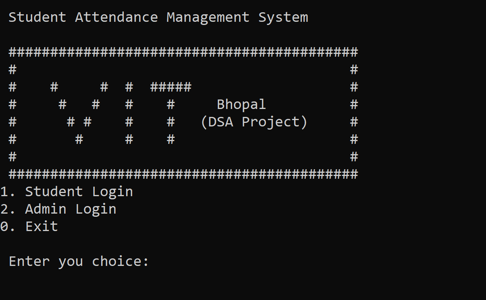

# Student Attendance System



## Table of Contents

- [Description](#description)
- [Features](#features)
- [Installation](#installation)
- [Usage](#usage)
- [Contributing](#contributing)
- [License](#license)
- [Contact](#contact)

---

## Description

The Student Attendance System is a C++ project designed to manage and keep track of student attendance for educational institutions. This system provides a simple and efficient way to record, view, and manage student attendance records, making it easier for educators to keep track of student participation in classes.

---

## Features

- User-friendly command-line interface.
- Add, edit, and delete student records.
- Record and view attendance for individual classes.
- Generate attendance reports for specific time periods.
- View statistics and summaries of attendance records.
- Secure login system to restrict access to authorized personnel.
- Easily customizable to suit the needs of different educational institutions.

---

## Installation

To run the Student Attendance System, follow these steps:

1. Clone this repository to your local machine:

   ```bash
   git clone https://github.com/your-username/student-attendance-system.git
